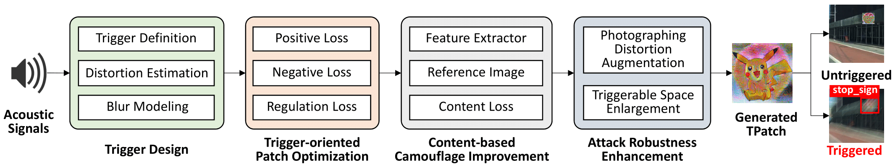
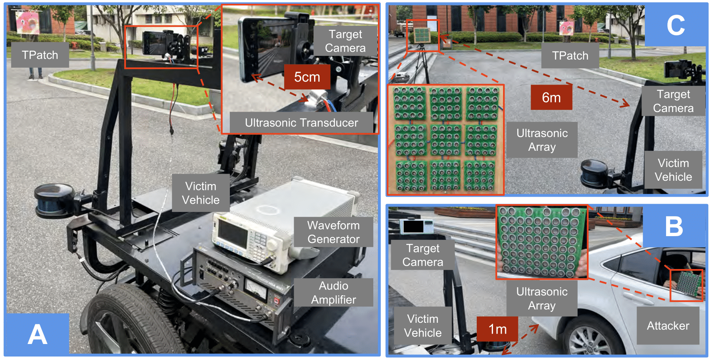

# What is *TPatch* attack?

Autonomous vehicles increasingly utilize the vision-based perception module to acquire information about driving environments and detect obstacles. Correct detection and classification are important to ensure safe driving decisions. Existing works have demonstrated the feasibility of fooling the perception models such as object detectors and image classifiers with printed adversarial patches. However, most of them are indiscriminately offensive to every passing autonomous vehicle.

In this paper, we propose *TPatch*, a physical adversarial patch triggered by acoustic signals. Unlike other adversarial patches, *TPatch* remains benign under normal circumstances but can be triggered to launch a hiding, creating or altering attack by a designed distortion introduced by signal injection attacks towards cameras. To avoid the suspicion of human drivers and make the attack practical and robust in the real world, we propose a content-based camouflage method and an attack robustness enhancement method to strengthen it. Evaluations with three object detectors, YOLO V3/V5 and Faster R-CNN, and eight image classifiers demonstrate the effectiveness of *TPatch* in both the simulation and the real world. We also discuss possible defenses at the sensor, algorithm, and system levels.

# How does *TPatch* work?

## Overview

- The **Trigger Design** module first defines the positive trigger that activates *TPatch* and the negative trigger that suppresses *TPatch*. Then, to find the feasible positive triggers, the module estimates the image distortion caused by physical signals and regularizes the distortion with a proposed theoretical model.
- The **Trigger-oriented Patch Optimization** module then designs loss functions based on the selected positive and negative triggers to generate *TPatch* capable of achieving the corresponding attack goals via gradient optimization.
- The **Content-based Camouflage** module further improves the visual stealthiness of *TPatch* by applying meaningful content extracted from a reference image using a pre-trained feature extractor.
- The **Real-world Robustness Improvement** module improves the robustness of *TPatch* in the real world by addressing both the deformation of the patch and the errors of the trigger signal.

## Environment

- python 3.8.11
- numpy 1.22.4
- torch 1.9.0
- torchvision 0.10.0
- opencv-python 4.5.3.56
- Pillow 9.2.0
- scipy 1.7.1
- matplotlib 3.4.3

## Datasets

We evaluate the Altering Attacks (AA) with the ImageNet.
We evaluate the Hiding Attacks (HA) and Creating Attacks (CA) with the MSCOCO, KITTI, and BDD100K.
Please build the `dataset` folder in advance following the [README](dataset/README.md).

## Models

You can download these models and place them under the folder `weights`.

- [`vgg13.pth`](https://download.pytorch.org/models/vgg13_bn-abd245e5.pth)
- [`vgg16.pth`](https://download.pytorch.org/models/vgg16_bn-6c64b313.pth)
- [`vgg19.pth`](https://download.pytorch.org/models/vgg19_bn-c79401a0.pth)
- [`resnet50.pth`](https://download.pytorch.org/models/resnet50-0676ba61.pth)
- [`resnet101.pth`](https://download.pytorch.org/models/resnet101-63fe2227.pth)
- [`resnet152.pth`](https://download.pytorch.org/models/resnet152-394f9c45.pth)
- [`incv3.pth`](https://download.pytorch.org/models/inception_v3_google-0cc3c7bd.pth)
- [`mobv2.pth`](https://download.pytorch.org/models/mobilenet_v2-b0353104.pth)
- [`fasterrcnn.pth`](https://drive.google.com/file/d/1lbvP04Y0M7-5Sw0Lny-XwHukpszA76iL/view?usp=sharing)
- [`yolov3.pt`](https://drive.google.com/file/d/1rFtQ1Nli063IstVg51ovpP3MXgpBo1jK/view?usp=sharing)
- [`yolov5m.pt`](https://drive.google.com/file/d/1J_Cw7JUO1VfgKCfHgExB-jEAK55BuCDN/view?usp=sharing)

# Demo

Here are several [demo videos](https://sites.google.com/view/triggered-patch) of real-world evaluation.

# Paper

For more details, you can download the paper from this [link](./assets/TPatch.pdf).

# Contact

* Prof. Wenyuan Xu (<wyxu@zju.edu.cn>)
* Prof. Xiaoyu Ji (<xji@zju.edu.cn>)

# Powered by

## Ubiquitous System Security Laboratory (USSLab)

## Zhejiang University 

